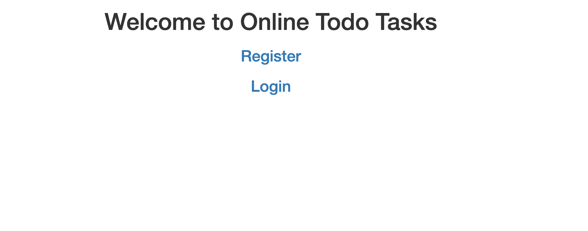
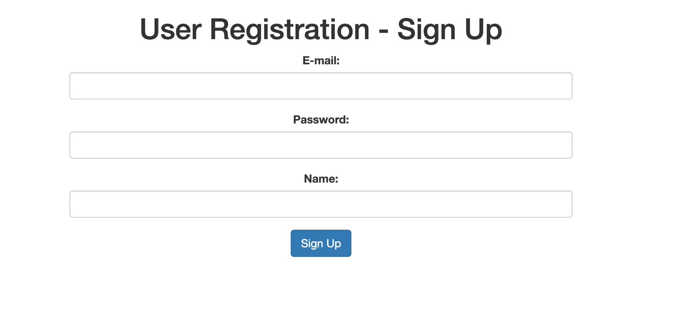
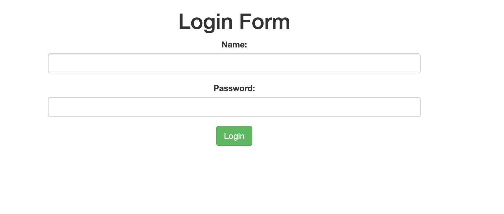
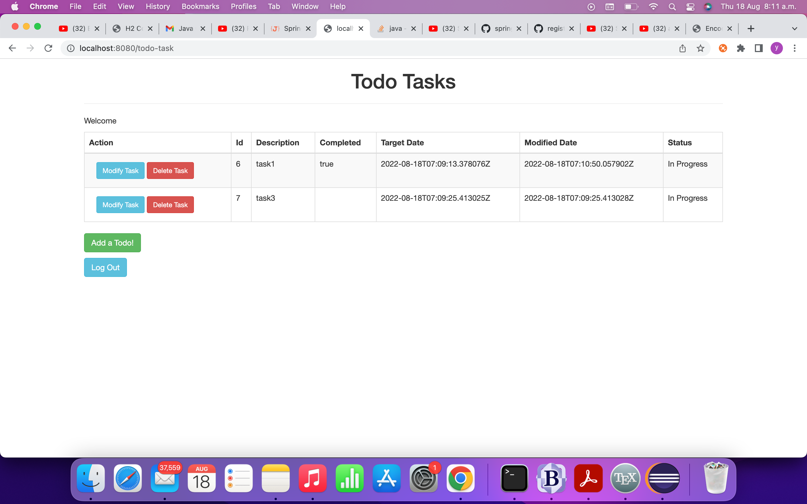

# Deloitte Java Project

To Create a Online Todo Tasks for the multiple users

# Table of Contents

- [Approach Taken](#approach-taken)
- [Design Patterns](#design-patterns)
- [Time Constraint](#time-constraint)
- [Results](#results)

# Approach Taken

Here The architecture used was based on Spring boot framework to work on the Project. The IDE used is eclipse. I have used Thymeleaf which is a java template engine for processing and creating HTML, XML, JavaScript, CSS and text. I have also used H2 as in memory database. I have divided the project into two parts 1) Users and 2) Todo Tasks. There can be multiple users who can have multiple tasks. For Security I have used BCryptPasswordEncoder, which saves the variable in an encrypted format. So In this project, the password will be encypted and saved in the in memory data base table.

# Design Patterns

Here The Design Pattern used was builder Design Pattern to divide the problem set in to sub problems using interfaces.

# Time Constraint

Due to time constraint, junit test cases were not implemented. If given more time the project would have been extended with JSON Web Token(JWT) for Authentication and Authorization purpose and would have added admin user who can view all the tasks of all users.

# Results

**Home Page**

**Sign In Page**

**Log In Page**

**Todo Tasks Page**

**All our dreams can come true if we have the courage to pursue them**
                                             **- Walt Disney**
